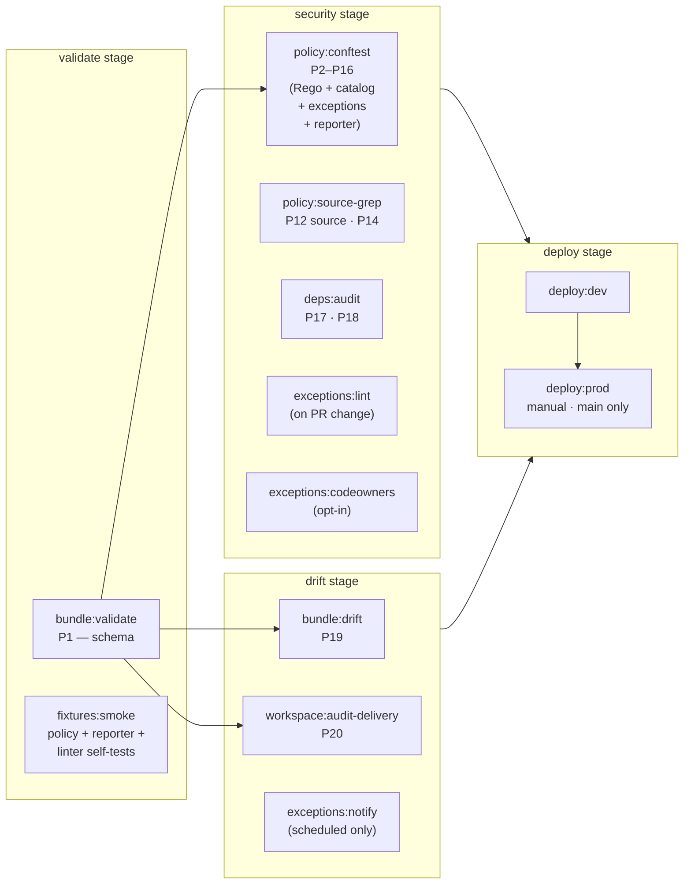

# Databricks Asset Bundles — Reference Pack

A self-contained set of reference materials for **understanding, hardening, and
gating Databricks Asset Bundles (DABs) before deployment**. Built for
developers and platform engineers shipping bundles into a regulated
environment.

If you are starting from zero, read `DAB.md` first — it is the conceptual
introduction. Everything else here is the production-grade tooling that
implements what `DAB.md` describes.

## What's in this directory

| Path | Purpose |
|---|---|
| `DAB.md` | Developer reference: what a DAB is, the structure of `databricks.yml`, resources, variables, targets, permissions, secure-by-default settings, and CLI commands. |
| `pre-deploy-checks.md` | Catalog of 20 deterministic, pre-deployment security checks (P1–P20) with severity, risk, predicate, and enforcement layer. |
| `EXCEPTIONS.md` | Per-rule catalog of legitimate-waiver patterns: when a finding warrants an `exceptions.yaml` entry, recommended `resource:` scope and `expires:` cadence, anti-patterns, and a reviewer checklist. |
| `secure-bundle.example.yml` | Annotated `databricks.yml` template demonstrating every secure-by-default setting. Each control is tagged with the P-rule it satisfies. |
| `policy/dab.rego` | OPA / Conftest policy pack implementing P2–P16 against the resolved bundle JSON. |
| `policy/dab.catalog.yaml` | Per-rule catalog of `title`, `severity`, `why`, `fix`, and references — consumed by the reporter to produce rich findings. |
| `policy/exceptions.yaml` | Time-bounded waivers (rule_id, resource glob, reason, approver, expires). Empty by default. |
| `scripts/conftest_report.py` | Wraps `conftest`, joins findings with the catalog, applies waivers, emits Markdown / JUnit / JSON / SARIF. Used as the pipeline gate. |
| `scripts/validate_exceptions.py` | Two subcommands: `lint` (PR-time schema + expiry validation, optional CODEOWNERS check) and `notify` (scheduled-pipeline digest of waivers expiring within configurable thresholds). |
| `scripts/diff_bundle.py` | P19 — structural diff of resolved-bundle vs deployed-bundle JSON. |
| `scripts/check_audit_delivery.py` | P20 — confirms `system.access.audit` is fresh in the target workspace. |
| `fixtures/good.json` | Resolved-bundle JSON that satisfies every rule. |
| `fixtures/bad.json` | Resolved-bundle JSON that deliberately violates every implemented rule. |
| `fixtures/test_policy.sh` | Smoke test: zero denies on `good.json`; every P-rule fires on `bad.json`. |
| `gitlab-ci.example.yml` | End-to-end GitLab CI pipeline (validate → security → drift → deploy) wiring all of the above together. |

## The pipeline at a glance



## Try it locally

```bash
# 1. Validate the secure example bundle and run the policy pack against it.
databricks bundle validate -t prod -o json > bundle.resolved.json
python scripts/conftest_report.py \
    --policy policy/ \
    --catalog policy/dab.catalog.yaml \
    --bundle bundle.resolved.json \
    --markdown report.md \
    --fail-on high

# 2. Run the policy regression suite against the fixture pack.
fixtures/test_policy.sh
```

`fixtures/test_policy.sh` should print `PASS` on the good fixture and
`PASS: every expected rule fired against bad.json` on the bad fixture.

## Wiring into CI

The `gitlab-ci.example.yml` in this directory is a drop-in starting point.
Adjust:

1. The runner image and `before_script` to match your runner setup.
2. `id_tokens` audience to your GitLab instance (or replace OIDC with
   protected/masked CI variables holding service-principal credentials).
3. The `--fail-on` threshold (default `high`) to your risk posture.
4. The `environment:` keywords (`development`, `production`) to match your
   GitLab environments.

The reporter writes:
- `report.md` — human-readable; logged to job output and stored as artifact.
- `conftest-report.xml` — surfaced in the GitLab MR test widget via
  `reports:junit:`.
- `report.json` — machine-readable; archive for downstream tooling.
- `report.sarif` — SARIF v2.1.0; for GitHub Code Scanning, GitLab SARIF
  converters, DefectDojo, SonarQube, and other security dashboards.
  `security-severity` is set so consumers map findings to their own
  Critical/High/Medium/Low bands without ambiguity.

## Exceptions (waivers)

Sometimes a finding is a known, accepted risk for a defined window. The
exceptions file lets you waive findings deterministically without disabling
the rule globally.

```yaml
# policy/exceptions.yaml
- rule_id: P11
  resource: "resources.jobs.legacy_etl.tasks[*].libraries[*].pypi"
  reason: |
    legacy_etl pulls from internal Artifactory which guarantees immutability
    of published versions. Floating tag is acceptable until the migration
    to versioned package names completes (DATA-1234).
  approver: alice@example.com
  approved: 2026-04-15
  expires: 2026-09-30
  ticket: https://linear.app/example/issue/DATA-1234
```

Triage at report time:

| Match outcome | Effect |
|---|---|
| Unexpired exception | Waived. Listed in the report; does not fail the gate. JUnit `<skipped>`, SARIF `suppressions`. |
| Expired exception | Active with `[EXPIRED-WAIVER]` marker. Fails the gate. |
| No matching exception | Active. Normal threshold logic. |

### Layered enforcement

Expiry is enforced in four places, because ephemeral CI runners have no
persistent state:

1. **Pipeline-time** (reporter): compares `expires:` against
   `CI_PIPELINE_CREATED_AT` (preferred) or `GITHUB_RUN_STARTED_AT`, falling
   back to `datetime.now()`. Orchestrator timestamps are harder to forge in
   ephemeral runners than the runner's local clock.
2. **PR-time** (`validate_exceptions.py lint`): rejects malformed,
   already-expired, post-dated, or far-future entries. `--max-future-days 90`
   by default. Optional `--codeowners <path>` validates `approver:` against
   the CODEOWNERS rule covering `policy/exceptions.yaml` (opt-in only).
3. **Scheduled** (`validate_exceptions.py notify`): tiered digest of waivers
   expiring within `--warn-days 7,14,30` to a Slack webhook (or stdout for
   testing). Forces renewal action ahead of expiry.
4. **Build log** (reporter Markdown): every active waiver renders with
   days-remaining, approver, and ticket — visible decay clock in every job.

### Reporter flags relevant to waivers

| Flag | What it does |
|---|---|
| `--exceptions <path>` | Enable waiver application. Without it, no waivers are read. |
| `--no-waive-critical` | Refuse to apply waivers to Critical findings. They stay active with `[WAIVER-REJECTED]` marker. |
| `--strict-waivers` | Fail the gate if any exception did not match a finding (catches stale waivers). |

### Governance recommendations

- Add a CODEOWNERS rule restricting edits to `policy/exceptions.yaml` to
  the security team.
- Set `ENFORCE_CODEOWNERS=true` in the production environment to enable
  the `exceptions:codeowners` job.
- Schedule `exceptions:notify` to run daily; route the webhook to the
  channel that owns this policy.
- Keep `--max-future-days` ≤ 90. Waivers are not strategic — they are
  iterative.

## Severity policy

| Severity | What blocks the pipeline |
|---|---|
| `--fail-on critical` | Critical only |
| `--fail-on high` (default) | Critical + High |
| `--fail-on medium` | Critical + High + Medium |
| `--fail-on low` | All findings |
| `--fail-on none` | Reporter never fails (advisory mode) |

Findings below the threshold are still rendered in `report.md` and
`conftest-report.xml`, but do not fail the job.

### Severity is about deploy-blocking, not category

Severity (Critical / High / Medium / Low) controls **whether the pipeline
fails**. The qualitative category — security vs operational vs hygiene —
is documented per-rule in the `notes:` field of `policy/dab.catalog.yaml`
and surfaced in the reporter's Markdown and SARIF output.

The distinction matters for triage:

- **P6** (CLI version pinned) is Low severity because it's a **reproducibility
  / hygiene** control, not a security control. Don't escalate it as a
  security finding.
- **P15** (resources have explicit ownership) is Medium severity because it's
  an **operational availability** control, not an authorization gap. The
  failure mode is "resources orphan after offboarding," not "unauthorized
  access."
- **P11** (library versions pinned) is High severity, but **only covers
  bundle-declared libraries**. Python deps from `requirements.txt` are
  covered by P17/P18 in a separate CI job.
- **P12** (no credentials in variable defaults) is Critical, but it's a
  **regex-based defense-in-depth** control, weaker than gitleaks /
  trufflehog / GitHub push protection.

Read the `notes:` field on each rule before treating any finding in
isolation — the framing changes how you should react.

## Adding or modifying a rule

1. Add the deny rule to `policy/dab.rego`. Use the message format:
   `[<id>/<Severity>] <body> (resource: <path>)`.
2. Add a matching entry to `policy/dab.catalog.yaml` with `title`,
   `severity`, `why`, `fix`, `references`. The reporter fails CI if a
   finding fires for a rule_id with no catalog entry.
3. Update `pre-deploy-checks.md` with the new row.
4. Add a violation to `fixtures/bad.json` and verify the rule fires:
   `fixtures/test_policy.sh`.
5. If the rule applies to `secure-bundle.example.yml`, ensure the example
   already satisfies it (run the test against the good fixture).

## Files this directory does **not** include

- An actual deployable DAB. `secure-bundle.example.yml` is a *template*,
  not a working bundle. Real notebook/wheel paths, group names, SP IDs, and
  workspace hosts must be supplied by the user.
- Workspace-side runtime checks (SAT, smoke tests, SP entitlement
  validation). Those are post-deployment scans; this directory is the
  pre-deployment gate.
- Any organization-specific allowlists or denylists. The `broad_groups`
  set in `policy/dab.rego` is a starting point — extend it per org.
